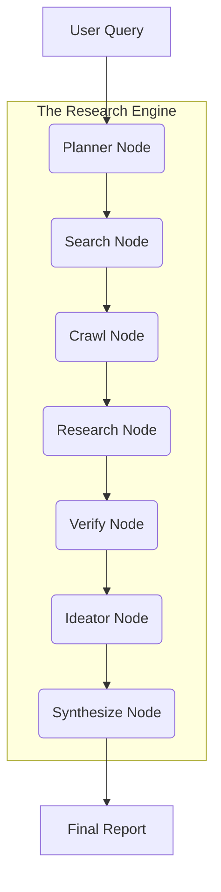

# 🧠 Deep Research System: Agentic Intelligence for Research Related Findings

[](https://www.python.org/downloads/)
[](https://github.com/langchain-ai/langgraph)
[](https://github.com/unclecode/crawl4ai)
[](https://deepmind.google/technologies/gemini/)

**Additional Work**-
https://github.com/avyaansharma/Multimodal-ResearchPaper-RAG
https://github.com/avyaansharma/DeepScholar_ConferenceFinder

A sophisticated, multi-agent research engine that dynamically plans, crawls, analyzes, and synthesizes deep technical insights into structured, citation-backed reports. Built on **LangGraph** and optimized for **Gemini 2.5 Flash Lite**, this system goes beyond simple search by simulating an elite research team.

---

## 🚀 Key Features

- **🎯 Dynamic Planning**: Generates tailored research strategies and multi-step search queries based on initial intent.
- **🕷️ Deep Crawling**: Leverages [Crawl4AI](https://github.com/unclecode/crawl4ai) for high-fidelity, markdown-optimized web extraction.
- **🤖 Specialized Agents**:
  - **Planner**: Maps out the research landscape.
  - **Research Orchestrator**: Manages parallel exploration of different focus areas.
  - **Verifier**: Critically evaluates findings to ensure accuracy and grounding.
  - **Expert Ideator**: Identifies research gaps and proposes groundbreaking future directions.
  - **Synthesizer**: Weaves verified findings and expert insights into a professional report.
- **⚖️ Smart Verification**: A dedicated step to prune low-quality or irrelevant information before synthesis.
- **🔄 Multi-Key Rotation**: Built-in support for multiple API keys to handle rate limits gracefully.
- **📝 Citation-Backed Output**: Generates a `final_report.md` with structured sections and source references.

---

## 🏗️ System Architecture

The system operates as a stateful directed acyclic graph (DAG) powered by **LangGraph**.



### Workflow Breakdown
1.  **Planning**: Analyze query complexity and generate a structured strategy.
2.  **Searching**: Use Tavily to find high-relevance URLs.
3.  **Crawling**: Deep-crawl identified sources to extract raw content.
4.  **Researching**: Specialized roles (Technical, Comparative, Theoretical) analyze the crawled data.
5.  **Verifying**: Validate findings against sources to eliminate hallucinations.
6.  **Ideating**: An "Elite Architect" agent looks for missing links and novel hypotheses.
7.  **Synthesizing**: Assemble the final document.

---

## 🛠️ Installation & Setup

### Prerequisites
- Python 3.10 or higher
- [Tavily API Key](https://tavily.com/) (for web search)
- [Google Gemini API Key](https://aistudio.google.com/)

### 1. Clone & Install
```bash
git clone https://github.com/yourusername/deep-research-system.git
cd deep-research-system
pip install -r requirements.txt
```

### 2. Configuration (`.env`)
Create a `.env` file in the root directory:
```env
# Primary Keys
GEMINI_API_KEY=your_gemini_key
TAVILY_API_KEY=your_tavily_key

# Optional Multi-Key Support (Rotation)
GEMINI_API_KEY_2=your_second_gemini_key
GEMINI_API_KEY_3=...
```

---

## 🏃 How to Run

Execute the main research script with your query as an argument:

```bash
python main.py "Future of Room-Temperature Superconductors in 2025"
```

If no argument is provided, it defaults to: *"Advancements in Multimodal Large Language Models 2024-2025"*.

### Output
The system will log its progress through different nodes (PLANNING, SEARCHING, etc.) and save the final result to `final_report.md`.

---

## 🧪 Technical Stack

- **Core Framework**: LangGraph (Stateful Agents)
- **Primary LLM**: Gemini 2.5 Flash Lite (Fast, High-Context, Cost-Effective)
- **Web Extraction**: Crawl4AI (Professional Web Crawling)
- **Search Engine**: Tavily API
- **Models**: Pydantic for strict data validation

---

## 🤝 Contribution

1. Fork the repository.
2. Create your feature branch (`git checkout -b feature/AmazingFeature`).
3. Commit your changes (`git commit -m 'Add some AmazingFeature'`).
4. Push to the branch (`git push origin feature/AmazingFeature`).
5. Open a Pull Request.

---

## 📄 License
This project is licensed under the MIT License - see the LICENSE file for details.

---
*Created by Avyaan Sharma*
